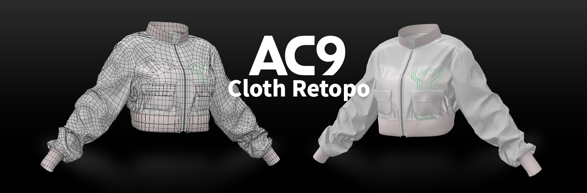

[English](README.md) | 日本語

# AC9 Cloth Retopo



CLO / Marvelous Designer で作った衣装メッシュを、平面に展開した型紙のかたち（2D）のままリトポロジーするための Blender アドオンです。
3D の形は、平面のリトポを高ポリの Guide へ重心座標で投影して得ます。編集は常に 2D、3D は閲覧専用の鏡（Mirror）という設計です。

- **対応 Blender**: 5.0 以上（5.0.1 / 5.1.1 / 5.2.1 LTS で確認）
- **バージョン**: 1.1.0
- **ライセンス**: GPL-3.0-or-later（[LICENSE](LICENSE)）
  Copyright (C) 2026 OpenFashion. 本プログラムはフリーソフトウェアです。
  Free Software Foundation が公表した GNU General Public License の
  バージョン 3、またはそれ以降の任意のバージョンの条件の下で、
  再配布および改変ができます。
- **確認した環境**: Windows。アドオン本体はプラットフォーム依存のコードを持たない純 Python で、唯一の外部依存も macOS / Linux 向けの公式 PyPI wheel を同梱していますが、その2つは作者が実行して確認していません。

## インストール

1. [最新リリースのページ](https://github.com/openfashion-labs/ac9_cloth_retopo/releases/latest) の
   **Assets** から `ac9_cloth_retopo-<バージョン>.zip` をダウンロードします。
2. Blender で **Edit > Preferences > Add-ons > Install from Disk** から、その ZIP を指定して有効化します。

> **Source code (zip)** と、ページ上部の緑の **Code** ボタンにある **Download ZIP** では
> インストールできません。どちらもソースツリーだけのアーカイブで、同梱している shapely の
> wheel が入っていないためです。`ac9_cloth_retopo-` で始まる ZIP を選んでください。

3Dビューポートのサイドバー（N キー）に **AC9 Cloth Retopo** タブが出ます。

他に入れるものはありません。Preview Fill と Grid Regions が使う shapely は wheel として
同梱してあり、アドオンを有効化したときに Blender が入れます。Python のバージョンは Blender
ごとに変わる（5.0 は Python 3.11、5.1 と 5.2 は Python 3.13）ため両方の wheel を同梱しており、
対象は Windows x64 / macOS arm64・x64 / Linux x64・arm64 です。例外は Windows on ARM で、
PyPI に shapely の wheel が無いため、その環境ではこの2機能が実行の代わりにその旨を表示します。

（開発者向け）ソースから ZIP を自分で作る場合:

```
blender --command extension build --source-dir ac9_cloth_retopo --output-dir .
```

## ドキュメント

日本語マニュアル: [docs/ja/](docs/ja/README.md)（概念 / インストール / 作業の流れ / パネル別リファレンス / Experimental / トラブルシューティング）

## 状態

v1.1.0。
未完成の機能は Add-on Preferences の **Experimental tools** を ON にしたときだけ表示されます
（既定 OFF）: Grid Regions, Align to Outline, Mesh Edit, Quad Fix, Legacy Flip, および
Density 一族（Density / Even Out / Count / Spacing / Pin / Corner）。それぞれ何が未完成なのかは
[05_experimental.md](docs/ja/05_experimental.md) にあります。
