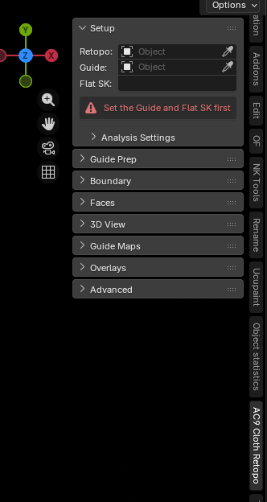

# 02. Installation and setup

## Requirements

| Item | Value |
|---|---|
| Blender | 5.0.0 or later (`blender_version_min` in `blender_manifest.toml`) |
| Version | 1.0.0 |
| License | GPL-3.0-or-later |
| Extra libraries | None to install by hand — shapely ships bundled with the add-on (see "About shapely" below) |

## Installation

1. Package the add-on as a ZIP.
2. In Blender, go to **Edit > Preferences > Add-ons**.
3. Choose **Install from Disk** from the menu in the top right, and point it at the ZIP.
4. Enable **AC9 Cloth Retopo** in the list.

Once enabled, an **AC9 Cloth Retopo** tab appears in the 3D viewport sidebar (N key).
Panels are ordered by workflow phase: **Prepare** / **Setup** / **Boundary** / **Faces** / **3D View** / **Guide Maps** / **Overlays** / **Advanced**.

In addition, whenever **Retopo** is set, three items are added to the 3D viewport header.
This is the one deliberately duplicated spot — a place you can hit without scrolling through the sidebar.

- The overlay master switch (eye icon)
- The **Overlays** popover
- **Refresh Mirror**

## Experimental tools switch

Expand **Edit > Preferences > Add-ons > AC9 Cloth Retopo** and there's exactly one switch.

- **Experimental tools** — off by default

Turning it on reveals 7 features in the sidebar that are otherwise hidden:

Grid Regions, Align to Outline, Mesh Edit, Quad Fix, Legacy Flip, UV Mirror (Guide Prep step 5), and the Density family (Density / Even Out / Count / Spacing / Pin / Corner)

These are unfinished features, hidden by default. See [05_experimental.md](05_experimental.md) for details.
While it's off, a hint reading "Experimental tools: Edit > Preferences > Add-ons > AC9 Cloth Retopo" appears at the bottom of the **Advanced** panel.

## About shapely

shapely is **bundled with the add-on** as Python wheels — you never install it by hand. It's declared under `wheels` in `blender_manifest.toml`, and Blender installs the matching wheel automatically when the add-on is enabled.
Ten wheels ship: five platforms (Windows x64, macOS arm64, macOS x64, Linux x64, Linux arm64) times two Python versions, because Blender 5.0 runs Python 3.11 and Blender 5.1 runs Python 3.13.

Everything except **Preview Fill** and **Grid Regions** (Experimental) works without shapely.

If the bundled wheel didn't install for a given Blender (the known case is Windows on ARM, for which no shapely wheel exists on PyPI), Preview Fill shows a warning row instead of running, and Grid Regions errors out the same way. See [06_troubleshooting.md](06_troubleshooting.md) if you hit this.

numpy is bundled with Blender, so there's no need to install it separately.
