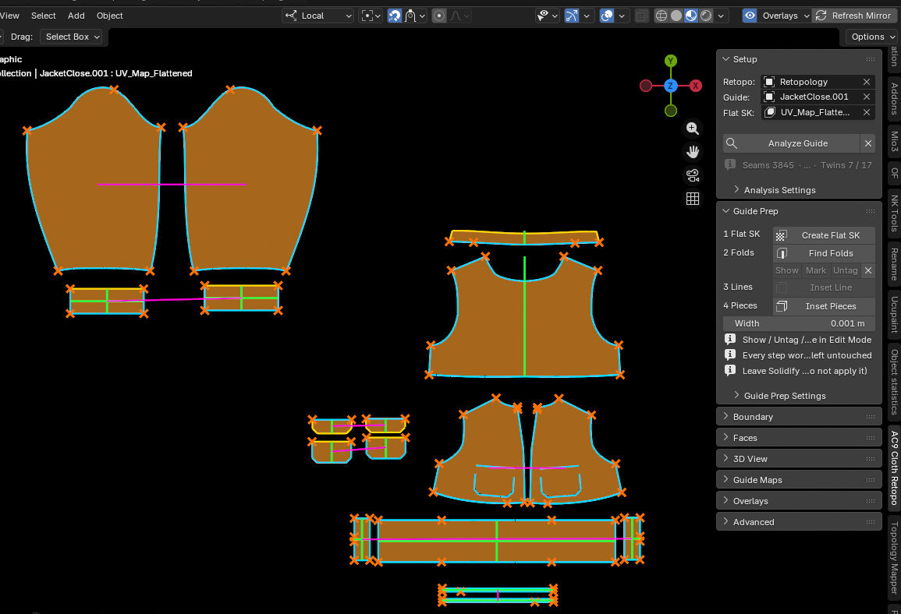
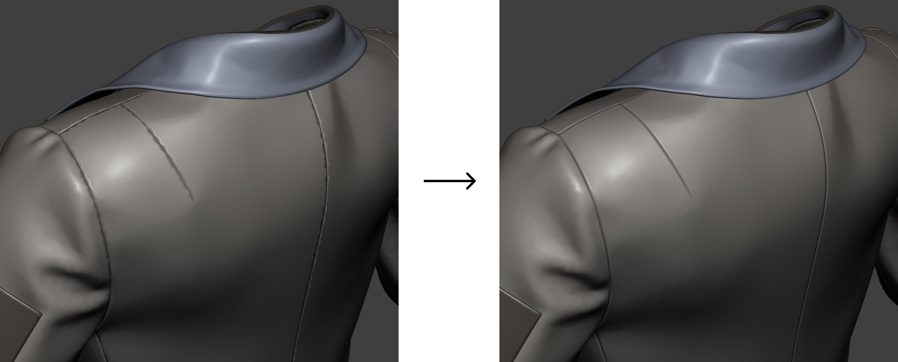
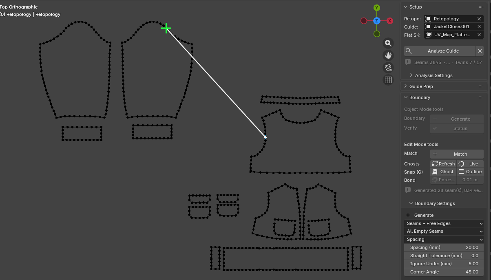
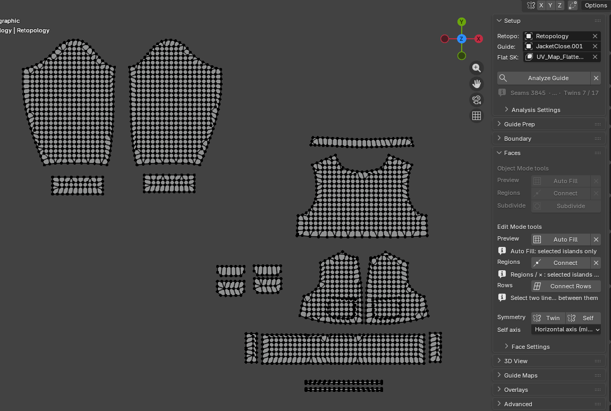
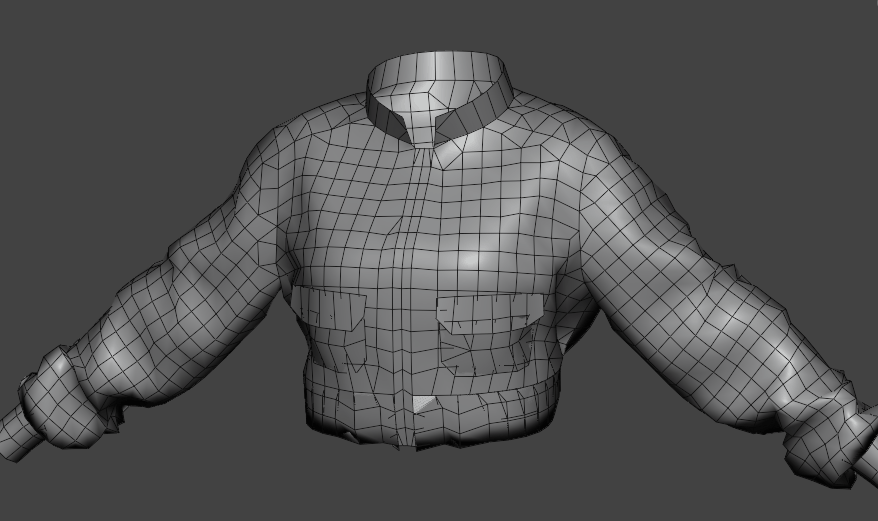
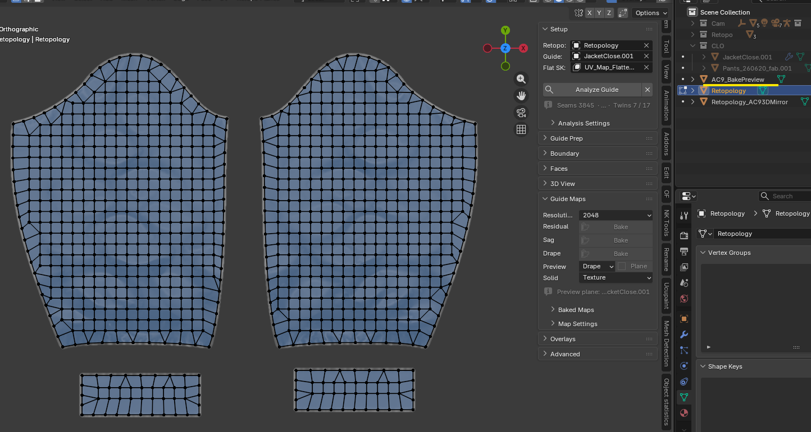

# 03. Workflow

It's a straight line from top to bottom. The order of panels in the sidebar is the order of the process.
Each step below lists what to check before moving to the next.

## 0. Export from CLO / MD

Export the garment from CLO / Marvelous Designer and import it into Blender.
Export as **FBX**, as a **triangulated mesh**, with the **UVs already unwrapped in CLO** (detailed export settings will be added later).
The add-on itself only assumes two things:

- The mesh is triangulated (**Create Flat SK** triangulates by default, so this is satisfied there)
- UVs are already unwrapped (objects with no UV layer are skipped by **Create Flat SK**)

Add thickness with a Solidify modifier, and keep it **live**.

## 1. Prepare — tidy up the CLO export

Tidies the outline and fold lines of the export so it can be used as a bake source. The panel's row numbers are the step order.
Every step works on the **Guide**, so set **Guide** in the **Setup** panel above first (**Retopo** can wait until section 2). What is selected or active does not matter; what matters is which object the **Guide** field points at, and which mode THAT object is in. A CLO export that came in as several objects is prepared by pointing **Guide** at each of them in turn.

1. **Create Flat SK** (Object Mode) — splits at UV island boundaries and writes the flat layout to a shape key. Steps 2–4 below need this shape key.
2. **Find Folds** — tags edges as fold lines where the dihedral angle is at least **Crease Min Angle**. Use **Show** to select and check what got tagged, **Mark** / **Untag** to adjust by hand, and **×** to clear everything.
3. **Inset Pieces** (Object Mode) — for each pattern piece, offsets the outline inward by **Width** on the flat shape key and rebuilds the ring between the outline and that new row as triangles, creating a vertex row parallel to the outline. Nothing is welded, so every outline vertex survives and the sewn pairs stay matched. Run this before **Inset Line** (the tagged fold lines are kept as constraints, so Inset Line never has to touch the outline).
4. **Inset Line** (Edit Mode) — insets a fold line on both sides into a band. Uses the **selected edges** (each connected run is one line); with nothing selected, it falls back to the **Find Folds** tags. The band stops at the row **Inset Pieces** left along the outline.

**Next**: the result line below the panel shows the counts of what happened (faces replaced, new row vertices, band faces, and the seam **desync** count). If **desync is not 0**, the 1:1 seam match is broken — don't move on with it.
Don't apply Solidify until the very end.

The payoff shows up in 3D. Left is the raw export, right is after **Inset Pieces** / **Inset Line** — the hard crease that ran along the fold line is gone.

## 2. Setup — specify inputs and analyze

1. Set **Retopo** to the low-poly mesh you're about to build, and **Guide** to the CLO export mesh.
2. Pick **Flat SK** from the Guide's shape keys via the search dropdown (**Create Flat SK** already filled it in for you in section 1).
3. Press **Analyze Guide**. This runs Seams (sewn pairs) → Symmetry (Folds and Twins) → Anchors (span breakpoints) in order. All of it only reads the Guide — Retopo isn't touched.

**Next**: below **Analyze Guide**, a line like `Seams NN · Anchors NN · Folds NN · Twins NN / NN` appears.
While it still shows the red "Seams not analyzed" warning, none of the overlays, ghosts, or snapping downstream will show anything.
**This analysis is cleared when you open the file and on Reload Scripts.** Press it again whenever that happens.

## 3. Boundary — build the 2D outline

Details are in the Boundary section of [04_panels.md](04_panels.md). The rough order is:

1. Object Mode: **Generate** — creates boundary vertex chains along the Guide's outline.
2. Edit Mode: knife-cut wherever you need.
3. Edit Mode: select the edge(s) (or vertex) on the side you trust and run **Match** — it creates the missing vertex on the opposite side of the seam. A selection is required: **Match** is a decision about which side is right, so pressing it with nothing selected is refused rather than sweeping every seam. It only ever adds, so a seam where both sides hold vertices the other lacks is left alone and shows up red in **Status**. When that happens, **Dissolve** the extra vertices on one side, then run **Match** again.
4. Object Mode: **Verify → Status**.

**Density** (**− 1** / **+ 1** / **Even Out**, **Count → Set**, **Spacing → Apply**) and **Corner** flags are not part of this flow any more: they are Experimental (see [05_experimental.md](05_experimental.md)) and only appear with **Experimental tools** on. Where a seam's two sides hold different numbers of vertices, **Match** is the answer; **Status** is what points at it.

To rebuild a seam at a new density, **delete both sides first**, then **Generate** (deleting only one side makes it inherit the partner's division).
A hole left by **Delete**-ing vertices is refilled by **Generate**; a spot left by **Dissolve**-ing them (the edge survives) is left untouched by **Generate**.
**Status** also counts and selects T-junctions (a vertex lying on an edge it is not joined to).

**Next**: once **Status** shows all green (both sides matching), move on to Faces.
While red (both sides present but not matching) or orange (only one side present) remain, the sewn seams won't line up in 3D even after faces are filled.
The full table is written out to the text block `AC9_SeamStatus`.

## 4. Faces — fill in the 2D interior

1. **Regions → Connect** — extends open lines to the nearest edge and connects them, then fills every closed region with faces. This is what makes the knife usable (the knife cuts faces, so an outline alone can't be cut). **No new vertices are created on the outline** (a line reaching the outline connects to an existing boundary vertex).
2. Freely subdivide the pattern piece with the knife (K). After cutting, pressing **Connect** again fills whatever regions the new cuts created.
3. Edit Mode: **Connect Rows** — select two lines (edges), and it runs a rung between each pair of corresponding vertices, splitting the faces between them into rows. If the vertex counts differ, vertices are added to the shorter side (the outline itself isn't subdivided).
4. **Symmetry → Twin** / **Self** — rebuild one side of a left/right pattern pair from the other side (**Twin**), or rebuild one piece from its own fold axis (**Self**). **Self** requires picking the axis with **Self axis** before pressing it. Both are destructive.
5. Object Mode: **Subdivide** — subdivides in 2D, snaps new boundary vertices onto the Guide's outline, and re-projects into 3D. The Mirror updates automatically if it exists. N-gons you haven't cut yet pass straight through, with only their count on the result row, so an unfinished piece never blocks checking the overall silhouette and poly count.

**Next**: the result line below the panel shows how many open ends were connected, how many regions were filled, and how many rungs were created.
Check the Mirror to confirm the face flow isn't broken anywhere.

**Subdivide** splits in 2D and re-projects into 3D, so raising the resolution never costs you the silhouette.

## 5. 3D View — check in 3D and finalize

1. **Mirror → Refresh** — rebuilds the Mirror from the current 2D layout. Works in Object Mode and in the Retopo's Edit Mode. Geometry only: it never changes what is visible — except the first time, when it creates the Mirror and switches **View** to **Mirror** so you can see it.
2. **View → Mirror** / **Guide** / **Both** — what is visible. **Mirror** is the working state: the retopo's 3D form alone, with the Guide hidden and laid out flat. **Guide** shows the garment alone, **Both** overlays the two. Check the retopo against the garment by going Mirror ↔ Both.
3. All three are plain visibility, so the Outliner is the escape hatch: hide the Mirror there while working in 2D, or un-hide the Guide to get its flat layout back as a backdrop.
4. **Wire → Wireframe** toggles the Wireframe overlay in every 3D Viewport at once, independent of the View state.
5. If needed, **Align → To Outline** snaps vertices within **Threshold** of the outline onto the outline itself and flags them as boundary.
6. **Finalize** — creates `<Retopo name>_Final`. The Retopo itself is untouched.

**Next**: `<Retopo name>_Final` becomes the selected/active object, and the result line shows its vertex count.
This is the deliverable you take out of the add-on.

### Put the Retopo AND the Mirror in Edit Mode together

**Point at it in 3D, fix it in 2D.** This is stock Blender (multi-object editing), but it is
easy to never think of, so here it is as a procedure.

1. Select **both** the Retopo and the Mirror, press **Tab**. Both enter Edit Mode.
2. In the 3D viewport, click a vertex on the Mirror to point at the place you want to fix.
   The **Selection Link** overlay marks where that vertex sits in the 2D layout, in orange.
   Markers follow the active object's selection only (the one you selected last). Make the Retopo
   active and it works the other way round (2D → Mirror) — but that direction needs the Guide
   projection cache, so right after opening a file it shows nothing until **Refresh** has run once.
3. Edit the **Retopo** in the 2D viewport.
4. Press **Refresh**: the Mirror catches up without either object leaving Edit Mode.

You always edit the Retopo. **The Mirror is a viewer** — edits made to it are overwritten on the
next Refresh; only its selection is read back.

This is also where hidden geometry pays off. Verts / edges / faces you hide on the Retopo with
**H** go hidden in the same place on the Mirror, with no button pressed (**Alt+H** brings both
back). Use it to work on a couple of pattern pieces in a crowded area. It travels one way,
Retopo → Mirror: hiding on the Mirror alone changes nothing on the Retopo and is undone by the
next sync. Blender only draws geometry as hidden in Edit Mode, so **a Mirror in Object Mode looks
the same as always** — the flags are there, and you see them the moment you Tab in.
**While Subdiv Preview is on, hidden geometry is not synced**: the subdivided Mirror has no vertex
correspondence with the Retopo.

## 6. Guide Maps — diagnostic bakes (optional)

Useful mid-work, when you want to see where things need fixing.

1. Pick a **Resolution** (1024 / 2048 / 4096, default 2048).
2. **Residual → Bake** — the offset between the Guide's surface and the current Retopo (red = Guide is closer, blue = farther, white = matching, dark gray = not yet covered by the Retopo). Image `AC9_ResidualMap_<Guide name>`.
3. **Sag → Bake** — the offset from each pattern piece's best-fit plane (white = bulging toward the viewer, black = sinking away, mid-gray = flat). Image `AC9_SagMap_<Guide name>`. The contour lines follow the edge-loop flow of low-frequency sagging.
4. **Drape → Bake** — Ambient Occlusion times Curvature, baked off the Guide's 3D shape into `AC9_DrapeMap_<Guide name>` (the two passes are deleted once the product exists). Useful as a guide for where to knife-cut in 2D. The scale AO reads at is **Map Settings → AO Distance** (default 30 mm); solid black panels mean it is set too high, because panels sewn flat against each other then occlude one another completely. The composite ratio is **AO Mix** (default 0.7).
5. Pick which map to view with **Preview**, then press **Plane** to create a 1×1 m plane called `AC9_BakePreview` and switch a Solid viewport to **Solid color = Texture**. X-Ray and the **Retopology overlay** are switched back off at the same time.
6. The plane sits 5 mm below the retopo, so the retopo hides it. **Add Transparent Material** makes the retopo semi-transparent so the map reads through the faces you are cutting; the **Alpha** slider sets how much (default 0.35).

Map images are per Guide, so several garments in one file never overwrite each other's bakes. What the file is carrying, and what it costs, is listed in **Baked Maps** — with buttons to throw any of it away.

**Next**: confirm the map is actually visible. If it isn't, check whether **Solid** is set to **Texture** and whether you pressed **Add Transparent Material** (the Preview Plane sits 5 mm below the Retopo).
Progress is shown only as staged text, since the bake itself (`bpy.ops.object.bake`) doesn't report incremental percentages — that stretch of the process will look stalled.

## 7. Cleanup

- **Advanced → Reset to Defaults** — resets only the setting values to their defaults. Leaves the Retopo / Guide / Flat SK assignments and meshes untouched.
- **Advanced → Clear All AC9 Data** — strips every trace of the add-on from this file. A list of what will be removed appears in a dialog before it runs.
