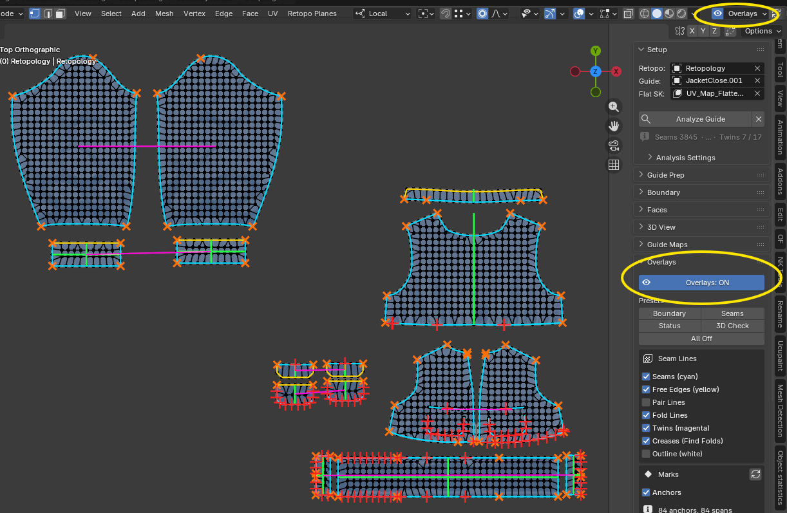

# 04. パネル別リファレンス

サイドバー **AC9 Cloth Retopo** タブの並び順に説明します。

## パネル共通の文法

どのパネルでも同じ種類のコントロールは同じ見た目になります。

| 見た目 | 意味 |
|---|---|
| **Check** / 実行名 の 2 つ組 | 同じ処理の「報告だけ」と「実行」。**Check** は何も変えません |
| 実行名 / **×** の 2 つ組 | 派生データを作るボタンと、それを消すボタン |
| **+** **−** **×** の 3 つ組 | 選択に印を付ける / 選択の印を外す / 印を全部外す |
| **Detect** | 候補を機械的に提案して選択状態にするだけ。採用は自分で **+** |
| 赤い警告行 | 硬い前提が満たされていない。下のボタンは動かない（多くは直すボタンが同じ行にある） |
| 情報アイコンの行 | 柔らかい前提。動くが機能は落ちる |
| 薄いグレーの 1 行 | そのパネルで最後に実行した結果 |

説明文はボタンのツールチップ（`bl_description`）に入っています。パネル本文に長い説明は出ません。
数値の設定は「**... Settings**」という子パネルにまとめてあり、既定で畳まれています。

**Boundary** と **Faces** は、Retopo が Object Mode か Edit Mode かで表示が切り替わります。
いまのモードのツールが上に出て、もう一方は 1 行の折りたたみ（**Object Mode tools** / **Edit Mode tools**）に入ります。
折りたたみを開いても、モードが違うオペレータはそれぞれの `poll()` でグレーアウトします。

---

## Prepare

CLO 書き出しをベイク元として整える工程。既定で畳まれています。
どのボタンも **Guide**（Setup で指定したもの）に対して、**Guide** のモードで動きます。アクティブオブジェクトや選択オブジェクトは見ません。このパネルを開く前に **Guide** を指定してください。書き出しが複数オブジェクトなら **Guide** を 1 つずつ差し替えて整えます。Guide の中での頂点・辺の選択はそのまま意味を持ちます（**Inset Line**、**Mark** / **Untag**、**Pairs** / **Self**）。

| ボタン | すること | 前提 | 結果 |
|---|---|---|---|
| **Create Flat SK** | Guide を UV アイランド境界で分割し、平面レイアウト `(u, v, 0)` をシェイプキー `<UV名>_Flattened` に書く。既定で三角化してから実行 | Guide 指定済み / Guide が Object Mode | シェイプキーが増え、値 1.0 で表示され、**Flat SK** 欄がその名前に更新される。UV レイヤの無い Guide は警告で拒否される。Basis は触られない |
| **Find Folds** | 二面角が **Crease Min Angle** 以上の辺を crease としてタグ付け。平面シェイプキーがある場合、表示中のキーに関係なく Basis 形状で測る | Guide 指定済み（どちらのモードでも可） | タグ数が結果行に出る。ライブの Solidify は見ない |
| **Show** | crease タグの付いた辺を選択して見せる | Guide が Edit Mode | 選択が置き換わる |
| **Mark** | 選択辺を手で crease にする（**Inset Line** が拾う） | Guide が Edit Mode / 辺を選択 | タグが増える |
| **Untag** | 選択辺のタグを外す | Guide が Edit Mode / 辺を選択 | タグが減る |
| **×** | crease タグ（辺属性 `ac9_crease_kind`）を全消し | Guide 指定済み | タグが全部消える |
| **Inset Line** | 折れ線を両側にインセット。**Width** より近い元頂点を線上へ吸収したうえで、線を左右 **Width** の 2 列にベベルし、crease 自体は中央列として残す。2 頂点以上選択されていればそれを使い（**Extend Along Fold** で線に沿って外へ辿る）、無ければ **Find Folds** のタグを使う | Guide が Edit Mode / 平面シェイプキー必須 | 帯ができる。結果行に線の頂点数・修復した辺・吸収数・除去した針・帯幅の達成率（最小値つき）が出る |
| **Inset Pieces** | 型紙ごとに、外周から **Width** 以内の頂点を外周へ吸収してから外周を **Width** インセットし、縫い目も自由辺も区別なく平行な頂点列を作る | Guide が Object Mode / 平面シェイプキー必須 | 結果行に型紙数・吸収頂点数・除去した針・統合した外周スリバー・広げた角・スリット先端・帯の面数が出る |
| **Width** | インセットの半幅（メッシュ単位、既定 0.001 = 1 mm）。この距離より近い元頂点は先に吸収される。大きいほど陰影のグラデーションが緩くなる | — | 上の 2 つのインセットに効く |

**実行順の注意**: **Inset Line** を **Inset Pieces** より先に実行してください。帯が、まだインセットされていない外周まで届く必要があります。
パネルの行番号 1 Flat SK / 2 Folds / 3 Lines / 4 Pieces が正です。

Solidify はこの工程を通じてライブのモディファイアのままにしてください。書き出しはリトポの Guide でもあり、適用するとそれが壊れます。

### Prepare Settings（子パネル）

| 設定 | 効く先 |
|---|---|
| **Crease Min Angle** | **Find Folds** の閾値（度、既定 60）。60 なら Solidify の rim（90°）と押した折り目を拾い、ドレープのしわは拾わない |
| **Extend Along Fold** | **Inset Line** で、選択の両端から折れ線に沿って外へ辿るか（既定 ON）。2 頂点選ぶだけで線全体を処理できる |
| **Fold Min Angle** | 辿るとき、二面角がこの角度以上の辺だけを折れ線とみなす（度、既定 6）。柔らかい折り目では下げる |
| **Line Profile** | **Inset Line** の帯の断面（既定 1.0）。1.0 は crease をそのまま残し左右を平坦にする、0.5 は帯幅で折り目を丸める |

---

## Setup

全ツールが共有する入力と、他パネルが依存する解析。

| 項目 | すること | 前提 | 結果 |
|---|---|---|---|
| **Retopo** | これから作る低ポリメッシュを指定 | メッシュオブジェクト | 全パネルの対象が決まる。ここが空だと **Faces** 以降は赤い警告になる |
| **Guide** | 3D 形状（Basis）と平面レイアウト（Flat SK）の両方を持つ三角形メッシュを指定 | メッシュオブジェクト | 全解析の読み元になる |
| **Flat SK** | 平面レイアウトのシェイプキー名。Guide にシェイプキーがあれば検索ドロップダウンになる | Guide 指定済み | 例: `UV_Map_Flattened` |
| **Analyze Guide** | Seams → Symmetry（Folds + Twins）→ Anchors をまとめて実行。Guide の読み取りのみ | Guide と Flat SK | 下に `Seams … · Anchors … · Ghosts … · Folds … · Twins …/…` の 1 行が出る |
| **×** | 全解析（Seams とそこから作ったゴースト、Folds、Twins、Anchors）を消す | — | 描いていたオーバーレイが空になる |

**Seams の解析はファイルを開いたときと Reload Scripts で消えます。** そのときは赤い「Seams not analyzed」が出るので、もう一度 **Analyze Guide** を押してください。

<!-- screenshot: Setup パネル（Retopo / Guide / Flat SK と Analyze Guide、解析結果の行） -->

### Analysis Settings（子パネル）

3 つの解析を個別に実行する行と、その調整値。Guide ごとに 1 度決めればほぼ触りません。

| ボタン | すること |
|---|---|
| **Seams → Analyze** / **×** | Guide 上の縫い合わせペアを Flat SK 空間で見つけ、縫い目オーバーレイを作る。ゴースト・スナップ・縫い目オーバーレイの全てがこの結果を読む |
| **Symmetry → Analyze** / **×** | Folds（1 アイランド内の対称軸）と Twins（左右で鏡になる別アイランド同士）の両方を検出。**Generate** は Folds を使って軸上に頂点を置き、**Self** / **Twin** は片側からもう片側を作り直す |
| **Anchors → Analyze** | Guide のアンカー点（3 枚以上の型紙が集まる点、縫い目が自由辺に変わる点）と、それが外周を切り分けるスパンを表示。スパンは密度編集の単位。読み取り専用 |

調整値は次のとおりです。

- **Analyze Seams**: **Merge Precision** / **3D Match Distance** / **Marked Seams (Sharp)**（ON のとき **Marked Seam Distance** が有効）
- **Ghosts**: **Max Seam Distance** / **Bond Distance**
- **Analyze Symmetry**: **Symmetry Tolerance** / **Twin Tolerance**

Folds と Twins は 1 つのボタンで検出されますが、許容値は別々に持っています。同じ正規化をしていても、ダーツのある型紙で再検証せずに統合すると Twin の判定が過剰または不足になりうるためです。

---

## Boundary

リトポの 2D 外周（境界線）を作り、縫い目の両側で頂点を揃える工程です。
Object Mode では外周全体、Edit Mode では選択した箇所を扱います。

### Object Mode tools（外周全体）

**Generate** / **Match** / **Status** は実行のたびに Guide のスパン（**Generate** は Folds も）を計算し直すので、キャッシュされた解析に依存しません。

| ボタン | すること | 前提 | 結果 |
|---|---|---|---|
| **Boundary → Generate** | Guide の外周（縫い目で区切られた各スパン）に沿って、リトポの境界頂点列を生成する。両側を同時に、スパンに沿って同じ位置に置くので 3D で同じ点に来る | Object Mode / Guide + Retopo | 既に境界がある部分は触らない。間隔・個数・対象・角の閾値は **Boundary Settings** の **Generate** 欄 |
| **Verify → Status** | 型紙輪郭全体をリトポと照合する。**縫い目**は 緑 = 両側が対応、赤 = **両側の頂点数が違う**（Match / Generate で埋まる）、紫 = **数は同じだが縫い目に沿って位置がそろっていない**（頂点を動かすしかない）、オレンジ = 片側だけ。**フリー辺**（裾・開き・襟ぐり）は相手側が無いので「対応」という判定が存在せず、外周に載っているかだけを見る: 青緑 = 載っている、紫 = 外周から 1mm 超ずれている（フリー辺に数の概念は無いので、ずれ＝位置の問題として紫に揃えている） | Object Mode / Guide + Retopo | Seam Status オーバーレイで色が付き、問題の縫い目とランの頂点、および T字接合（辺の上に乗っているのに繋がっていない頂点）が選択され、全件の表がテキストブロック `AC9_SeamStatus` に書き出される。縫い目で報告される 2 つの数値は align（対応頂点が縫い目に沿ってどれだけ離れているか）と offset（リトポが Guide の外周からどれだけ外れているか）。フリー辺は offset だけ。フリー辺の行は**ラン単位**（連続した裾 1 本 = 1 行、**Generate** が分割するのと同じ単位）で、スパン単位ではない |

**Faces に進む前の合格判定は Status です。**

### Edit Mode tools（選択した箇所）

**Density**・**Count**・**Spacing**・**Pin**・**Corner**（**Corner → Detect** 含む）は Experimental です — [05_experimental.md](05_experimental.md) 参照。**Match**・**Snap (G)**・**Bond → Force Bond** は Experimental ではありません。

| ボタン | すること | 前提 | 結果 |
|---|---|---|---|
| **Density → − 1** / **+ 1** | 選択スパンの頂点を 1 つ減らす / 増やす。**縫い目の両側同時** | Edit Mode / 境界の辺（または内部の境界頂点 1 つ）を選択 / Experimental ON | 面を壊さない局所編集を先に試し、無理なスパンだけ作り直す（作り直すと Preview Fill は消える）。Pin と Corner は動かない |
| **Density → Even Out** | 個数を変えず間隔だけ均す。頂点を足しも消しもせず、面にも触らない | 同上 | 既存頂点が移動するだけ |
| **Count → Set** | 指定個数にする | 同上 | 上と同じ非破壊優先 |
| **Spacing → Apply** | 指定間隔（mm）にする | 同上 | 同上 |
| **Match** | 選択している辺（または頂点）の側を正とし、その縫い目だけ、対岸に足りない頂点を作る（既にあれば何もしない）。ナイフカットで外周に置いた頂点の相棒を作るのに使う | Guide + Retopo / Edit Mode で選択 | 挿入位置は「チェーンの端の外側」優先。既存頂点の間に割り込むと隣のクワッドが n-gon になるので、その件数を報告する。新しい頂点が既存の境界辺の上に来る場合はその辺を割る。足すだけで、頂点を減らしたり均したりはしない（それは **Density**）。Pin も付けないので、意図して置いた頂点を **Density** から守りたいときは別途 **Pin → +** を押す。両側に相手の無い頂点がある縫い目は触れず、理由（repositioning が要る／選択側が手薄で削除が必要／選択側に頂点が無い）ごとに件数を報告する。**選択が無いときは拒否される**: 以前は全縫い目が対象で頂点が多い側が正になったが、まだ作っていない型紙にまで頂点が増えうるため、スクリプトから `every_seam=True` を明示したときだけの動作になった（どのボタンも渡さない）。**Check** ボタンも無くなった（**Verify → Status** の隣に2つ目の検査があるように見えるうえ、足すだけ・Ctrl+Z で戻せる操作の件数を先に見るだけだったため）。`apply` はオペレータに残っているので F3 やスクリプトからは dry-run できる |
| **Pin → +** / **−** / **×** | 選択頂点を Pin / Pin を外す / 全 Pin を外す | Edit Mode / Retopo を選択 / Experimental ON | Pin = 「この頂点は意図して置いた。**Density** で消したり滑らせたりしないでほしい」という印。面が付いた後のカット頂点は形状からは普通の頂点と区別できないので、自動判定ではなく手動の印。Pin が安全なのは同じ 3D 位置が縫い目の反対側でも Pin されているときだけ |
| **Corner → +** / **−** / **×** | 選択頂点を Corner にする / 外す / 全部外す | Edit Mode / Retopo を選択 / Experimental ON | Corner = 「ここで型紙を区切り、エッジフローを曲げてよい」という印。リトポのメッシュ属性に保存されるのでファイルを閉じても残る |
| **Corner → Detect** | 型紙自身の幾何から Corner の候補を提案する（**Boundary Settings** の **Candidate Angle**） | Object Mode / Guide + Retopo / Experimental ON | 提案するだけで印は付かない。境界生成が区切りを打つのと同じ測り方なので、提案には必ず頂点が載っている。載る頂点が無かった件数は報告される |
| **Snap (G) → Ghost** | G キーでの移動時、**Snap Distance** 以内のゴースト点（対岸の対応点）だけにスナップする | Edit Mode / ゴーストがある | **Outline** と排他 |
| **Snap (G) → Outline** | G キーでの移動時、Guide の型紙外周線（縫い目 + 自由辺）の最近点にスナップする | Edit Mode / 縫い目の解析済み | 境界頂点を外周線に落とすのに使う。Folds があれば **Fold** トグルも出る |
| **Bond → Force Bond** | 選択頂点を、**Bond Distance** 以内の最も近いゴーストへ正確にスナップする | Edit Mode / ゴーストがある | 非破壊。範囲内にゴーストが無い選択頂点と、非選択の頂点は触られない |

**Detect** で拾えるのは裾の直角や襟の先端のような幾何的な角です。「脇縫いの途中でフローを変えたい」といった角は幾何では分からないので手で **+** してください。

**フリー辺のゴーストについて。** 縫い目のゴーストは「対岸の対応点」ですが、フリー辺には対岸がありません。代わりに **その頂点から最寄りのフリー辺への垂線の足** がゴーストになります。外周にきちんと載っている頂点は足＝自分自身なので「配置済み（緑）」、外周から外れている頂点だけが赤十字と線で残ります。**Only Unplaced** と組み合わせると「外周から外れているフリー辺の頂点」だけが見えます。
足は **Refresh Ghosts** した時点の静的な点で、ドラッグに追従しません。裾に沿って頂点を連続的に動かしたいときは **Snap (G) → Outline** を使ってください。

### Boundary Settings（子パネル）

| 設定 | 意味 |
|---|---|
| **Generate**（scope） | **All Empty Seams** = リトポが無い縫い目を全部 / **Nearest to 3D Cursor** = 3Dカーソルに一番近い 1 本だけ |
| **What**（targets） | **Seams + Free Edges**（全部の型紙境界を閉じる。面を張る前提） / **Sewn Seams Only** / **Free Edges Only**（裾・開き・ネックラインなど） |
| **Divide By** | **Spacing** = 長さの違う縫い目でも密度が揃うよう個数を決める / **Count** = どの縫い目も同じ個数 |
| **Spacing (mm)** / **Vertices** | 上の選択に応じて片方が出る |
| **Straight Tolerance (mm)** | Spacing のとき。既定 0 は直線区間も Spacing で分割する。上げると、輪郭がこの距離以内で直線とみなせる区間（縫い目なら両側とも）は分割せず角だけになる（カーブは Spacing で分割） |
| **Ignore Under (mm)** | これより短い縫い目は無視する |
| **Corner Angle** | 角とみなす角度 |
| **Match** → 許容値 | **Match** の一致判定 |
| **Corners** → **Candidate Angle**（Experimental） | **Detect** の閾値 |

---

## Faces

外周ができたあと、2D の内側を埋めて整える工程。

### Object Mode

| ボタン | すること | 前提 | 結果 |
|---|---|---|---|
| **Regions → Connect** | 開いた線を最後のセグメント方向へ延長して最初にぶつかった辺まで繋ぎ（短いものから順に）、そのうえで閉じた領域すべてに面を張る | Object Mode（Edit Mode 版もある） | **外周は分割しない**。外周に届いた線は最も近い既存の境界頂点に繋ぐので、縫い目の再 Match は不要。ナイフで切れる状態になる。5 mm 未満の突起（ナイフの切りすぎ）は自動で除去され、位置が報告される |
| **Preview → Auto Fill** | 各型紙の内側に使い捨てのクワッドグリッドを敷き、実際のトポロジーを作る前に外周の頂点数が正しいか判断できるようにする。境界頂点は 1 つも動かさない | Object Mode か Edit Mode（Edit Mode ではその場で動く）/ Guide + Retopo | 作ったもの全部にフラグを立て、**Clear Fill (×)** できれいに戻せる。最終トポロジーではない — 見て、密度を直して、もう一度実行する使い方。**Adjust Density** がスパンを作り直す必要が出たときは自分でこのフィルを消す。外形が閉じていない型紙はスキップされ、件数が報告される。この Blender 用の shapely が使えない場合、ボタンの代わりに警告行が出る |
| **Preview → Clear Fill (×)** | 直前の **Auto Fill** が作ったものを全部消す | 同上 | shapely は不要 — 前回のフィルを消すだけなので幾何ライブラリを必要としない |
| **Symmetry → Twin** | 選択頂点があるアイランドを正として、対になるもう片方のアイランドを作り直す | Guide + Retopo / 頂点を 1 つ選択 | 破壊的（対象側の頂点と面を全部消して作り直す）。実行時に Guide の対称性を再検出するので事前準備は不要。Ctrl+Z で戻せる |
| **Symmetry → Self** | 1 枚のアイランドの、選択頂点がある側を正として、折り軸の反対側を鏡像で作り直す | 同上 / **Self axis** を先に決める | 破壊的。軸を間違えると「何も変わらない」破壊的no-opになる |
| **Self axis** | **Self** が使う折り軸。**Auto**（左右非対称なほう＝まだ作業が残っているほうを選ぶ。両方とも同程度に非対称なら拒否）/ **Vertical axis (mirror left-right)** / **Horizontal axis (mirror top-bottom)** | — | 押す前に見えている必要がある設定なので、独立した行になっている |
| **Levels** / **Preview** | Levels 回だけ本物の Subdivide と外形スナップ・Guide 再投影を一時複製へ行い、その結果を Mirror に表示する | Object Mode / 2D 状態 | Retopo は低解像度のまま変わらない。Preview をもう一度押すと通常の Mirror に戻る。Preview 中に Retopo や Guide を編集すると **Preview（要更新）** になり、押すと再計算する。Refresh Mirror も表示中の Preview を再計算する。キャッシュは保存しない |
| **Commit → Subdivide** | Preview と共有する Levels でリトポを 2D で単純分割し、新しい境界頂点を Guide の縫い目線へスナップして 3D へ再投影する | Object Mode / 2D 状態のみ（`AC9_3D_Project` が表示状態だと動かない） | 破壊的で解像度が恒久的に上がり、Preview は一度外れる。新頂点も Guide 表面に投影されるのでスムーズ処理は不要。Mirror があれば通常状態で自動更新される。縫い目の解析が無い場合は動くがスナップを飛ばす（情報行で警告）。N-gon（5 角以上の面）は内部を割らずそのまま通過させ、残っている枚数だけを結果行に報告する（Blender の Subdivide の仕様。→ 06. うまく動かないとき） |

### Edit Mode

| ボタン | すること | 前提 | 結果 |
|---|---|---|---|
| **Regions → Connect** | 上と同じ。ただし選択があるアイランドだけを対象にする | Edit Mode / アイランドのどこかを選択 | 何も選択していないと警告で中止 |
| **Preview → Auto Fill** / **Clear Fill (×)** | Object Mode 側と同じ。ただし編集中のアイランドにその場で効く | Edit Mode / Guide + Retopo | shapely・警告行の挙動は上と同じ |
| **Rows → Connect Rows** | 2 本の線の辺を選ぶと、頂点対ごとに桟を通し、その間の面を切り抜いて列に割る（手で J を繰り返すのと同じこと） | Edit Mode / Retopo 自身を編集中 / 2 本の線の**辺**を選択 | 2 本は自動で端から端に対応付けられるので、描いた向きは問わない。頂点数が違う場合、少ない側の広い隙間に、多い側の間隔から取った頂点が足される（既存頂点は動かない）。**外周はこの方法では分割されない**（外周の頂点は 3D で相手側と対応しているため。そちらは **Density** の仕事） |
| **Symmetry → Twin** / **Self** / **Self axis** | Object Mode 側と同じ。**Twin** / **Self** はどちらのモードの選択も読むので両側に置かれている | — | Edit Mode は元になるアイランドを選ぶ場所 |

### Face Settings（子パネル）

**Preview Fill** の調整値（**Fill Spacing (mm)** / **Edge Clearance**）はここに常に表示されます。同じ子パネルの中の **Quad Fix** 欄（**Non-planar Angle** / **Flat Angle** / **Only Selected** / **Fix Saddles**）と **Grid Regions** 欄（**Grid Spacing (mm)** / **Side Smoothing** / **Fill Mismatched Regions**）は引き続き Experimental のときだけ出ます。

---

## 3D View

Mirror（2D リトポの閲覧専用 3D 表示）と、Guide を平面で見るか 3D で見るか（**View**）、そして **Finalize**。

| ボタン | すること | 前提 | 結果 |
|---|---|---|---|
| **Mirror → Refresh** | いまの 2D レイアウトを Guide 表面へ投影して Mirror を作り直す | Guide + Flat SK + Retopo / Object Mode か Edit Mode | Retopo は平面のまま編集可能。すでに Mirror がある場合はジオメトリだけを扱い、表示状態には一切触らない — View の状態も、Guide の Flat SK も表示 / 非表示も変えない。Mirror を新規に作るときだけ、**View** を **Mirror** に切り替えて見せる（そのときは尊重すべき既存の選択が無く、**Mirror** は Guide の Flat SK を 1 のままにする状態でもある）。ビューポートヘッダーにも同じボタンがある |
| **Mirror → ×** | Mirror を削除する | Mirror が存在する | Refresh でいつでも作り直せる |
| **View → Mirror** / **Guide** / **Both** | 表示状態を決める唯一の場所。見えるものの名前がそのままボタン名。排他で、現在の状態のボタンが凹む | Guide + Flat SK | **Mirror**: リトポの 3D 形状だけ。Guide は非表示にして平面（Flat SK = 1）に寝かせる＝2D リトポを編集する状態。**Guide**: 衣装だけ（Flat SK = 0）。同じ位置に重なる Mirror は非表示。**Both**: 衣装の上にリトポを重ねる。いずれもふつうの目アイコン（View Layer 単位）の表示 / 非表示なので、どのビューポートでも同じ意味になり、アウトライナーからいつでも上書きできる。手で隠せば、この行は実際に画面に出ているものをそのまま読み返す |
| **Wire → Wireframe** | **すべての** 3D Viewport の Wireframe オーバーレイを一括で切り替える。**View** の状態とは無関係の独立トグル | 3D Viewport が 1 つ以上ある | 押したビューポートの現在値を反転した値に全ビューポートを揃える。凹み表示はいま操作しているビューポートの値 |
| **Contact → Check** | Guide の互いに接触している層（プリーツ、巻きの重なり）を測定・色分けするだけで何も変えない | Object Mode | Guide 上の頂点色 `AC9_Gap`: 赤 = 接触、黄 = 隙間未満、緑 = 十分 |
| **Contact → Separate** | 接触している層の間に最小の隙間を開け、レイキャストのベイクが隣の層を拾わないようにする。結果は Guide 上のシェイプキー `AC9_Separated` に書く（Basis は元のドレープを保つ）。**3D Source** も自動的に **Separated** に切り替わる | Object Mode | 収束しないことがある — その場合、結果行に「まだ隙間未満の接触が N 個」（Solidify の厚みが原因と思われる場合はその旨も）に加え、移動量の最大値と法線の p99（度）が出るので、形をどれだけ壊したかを数値で確認できる。**Separation Settings** は **Gap** / **Smooth Radius** / **Max Iterations** / **Include Solidify** |
| **Contact → ×** | `AC9_Separated` と `AC9_Gap` を消して Basis に戻す | `AC9_Separated` が存在 | — |
| **3D Source** | 投影とマップが Guide の 3D 形状として読むシェイプキー。**Original**（Basis、書き出したままのドレープ。最終リトポ用）/ **Separated**（`AC9_Separated`、ベイク中用） | 分離済み | 切り替えると Guide の三角形キャッシュが破棄される。Mirror と投影は次の **Refresh** で追いつく |
| **Align → To Outline** | Guide の型紙外周（UV シーム辺）から **Threshold** 以内の各頂点について、2D 位置を辺上へスナップし、バリセントリック座標の 1 つがちょうど 0 になるようアタッチメントを作り直す。境界フラグも立てる | Guide + Retopo / Experimental ON | 旧 **Sync 3D > 2D** が外周にぴったり留めるための前処理。**Sync 2D > 3D** のあと 1 度実行する |
| **Threshold** | 上のスナップ許容距離（既定 0.003 = 3 mm） | Experimental ON | 大きすぎると内部頂点まで境界と誤判定される |
| **Finalize → Finalize** | Retopo + Guide の投影を素のメッシュ `<Retopo名>_Final` に焼く。形状 = Guide への投影、UV = 2D レイアウト、シェイプキーなし、`ac9_*` データなし | Object Mode / Retopo・Guide・Flat SK が揃っている | Retopo は触られない（平面のまま、編集可能なまま）。何度でも実行できる。作られた `_Final` が選択・アクティブになる |

**隠しジオメトリは Mirror に追従します。** Retopo が Edit Mode にある間、**H** / **Alt+H** で隠した頂点 / 辺 / 面が、ボタンを押さなくても Mirror の同じ場所に反映されます（**Refresh** も最後に同じことをするので、Object Mode で隠した状態から入っても揃います）。向きは Retopo → Mirror の一方向で、Mirror 側だけ隠しても Retopo は変わらず、次の同期で Retopo の状態に戻されます。Blender は Edit Mode でしか隠しを描画しないため、見た目に効くのは Mirror も Edit Mode に入れているとき（[03_workflow.md](03_workflow.md) の「Retopo と Mirror を両方 Edit Mode にする」）で、Object Mode の Mirror はこれまでどおりメッシュ全体を描きます。選択には触りません。

### Separation Settings（子パネル）

**Gap** / **Smooth Radius** / **Max Iterations** / **Include Solidify**。

---

## Guide Maps

診断用のベイク。既定で畳まれています。結果の画像は **Guide の名前を付けて** 保存されます（`AC9_SagMap_<Guide名>` など）。ジャケット・パンツ・スカートを 1 ファイルの中で並行して進めても、それぞれのマップが上書きされずに残ります。Image Editor で開いておけば、その Guide を再ベイクするたびに更新されます。

| ボタン | すること | 前提 | 結果 |
|---|---|---|---|
| **Resolution** | ベイク画像のサイズ（正方形）。**1024**（速いプレビュー）/ **2048**（推奨、既定）/ **4096**（遅い、最終確認用） | — | 下 3 つのベイクに効く |
| **Residual → Bake** | Guide 表面から現在のリトポまでの符号付き距離。赤 = Guide が手前、青 = 奥、白 = 一致、暗い灰 = リトポにまだ覆われていない | Object Mode / Retopo + Guide | 画像 `AC9_ResidualMap_<Guide名>`。結果行に RMS / p90 / max（mm）と覆われた頂点数が出る。どのリトポに対して測ったかは画像に記録され、Baked Maps の一覧に「vs <Retopo名>」と出る |
| **Sag → Bake** | 型紙（縫い目で区切られたアイランド）ごとの平面フィットからの符号付き距離。白 = 手前に膨らむ、黒 = 奥に沈む、中間の灰 = 平面上 | Object Mode / Guide | 画像 `AC9_SagMap_<Guide名>`。等高線が低周波のたわみに沿うエッジループの流れになる。結果行に型紙数と最大偏差 |
| **Drape → Bake** | Guide の **3D 形状**から Ambient Occlusion と Curvature（Geometry Pointiness）を焼き、平面レイアウトに載せて、さらに掛け合わせる。ベイクの間だけ Flat SK を一時的に外し、終わったら戻す | Object Mode / Guide | 画像 `AC9_DrapeMap_<Guide名>`。2D でナイフを入れるときの当たりに使う。AO と Curvature のパスは合成が終わると削除される（残したいときは **Keep Passes**） |
| **Preview** | Preview Plane が表示するマップ（**Residual** / **Sag** / **Drape**、**Keep Passes** が入っているときは **AO** / **Curvature** も） | — | 切り替えるとプレビュー用マテリアルの参照画像が差し替わる。どれも焼かれた 1 枚の画像なので Solid > Texture で表示できる。**参照するのは現在の Guide のマップ**で、Guide を差し替えるとプレーンも追従する（まだ焼いていなければ空になる） |
| **Plane** | Flat SK 空間に 1×1 m のプレーン `AC9_BakePreview` を作る（あれば再利用）。Emission マテリアルなので Image Editor 無しで見られる | Object Mode | Solid シェーディングのビューポートを **Solid の色 = Texture** に切り替え、**Retopology オーバーレイ**を ON にする（X-Ray は使わない。過去バージョンが ON にしていたら OFF に戻す）。Material Preview / Rendered のビューポートは触らない。**プレーンは z = 0 の 5mm 下**にあるので、z = 0 に平らに置かれている物（平面状態の Guide、平面リトポ、自作のベイク板）が上から見たときにプレーンを隠す。それらは**手で隠す**こと — このボタンは他オブジェクトの表示を触らない |
| **Solid** | ビューポート自身の Solid カラーソース（Viewport Shading > Color と同じプロパティ） | 3Dビューポート内 | **Texture** になっていないとマップは見えない。ここに出しているのはその設定を知らない人が多いため |

**ベイクの間、Blender の UI は完全に止まります。** ベイク本体（`bpy.ops.object.bake`）を直接呼んでいるため、進捗もキャンセルも出せません（**Drape** は内部で 2 回ベイクします＝AO と Curvature）。GPU なら 2048 で十数秒で終わりますが、**CPU だと 1 分以上**かかります（実測: 202k 頂点の Guide・2048 で **CPU 67.6 秒 / GPU 12.4 秒**）。

ベイクを軽くするために、アドオン側で 2 つのことをしています。**AO のレイ予算は 1 ピクセルあたり 1,024 本**（Cycles サンプル 16 × AO ノード 64。Cycles は AO ノードのサンプルを 128 で打ち止めにするので、それ以上の値を書いても意味がありません）。もう 1 つは、**ベイクの間だけ Guide 以外のオブジェクトを描画対象から外す**ことです。ベイクはシーンをレンダリングして UV に書き込む処理なので、`hide_render` が OFF の物はすべて同期され BVH に載ります。AO は Guide 自身しか遮蔽物に数えない設定なので結果は変わりませんが（実測の差は 0.0000）、時間は **CPU で 32%、GPU で 13%** 変わります。

そのため、アドオンのプリファレンス（Edit > Preferences > Add-ons > AC9 Cloth Retopo）に **Bake on GPU when available**（既定 ON）があります。プリファレンス > システム で GPU を有効にしていれば、**ベイクの間だけ** シーンの Cycles デバイスを GPU にして、終わったら元に戻します。**Cycles で一度もレンダリングしていないシーンは CPU を持っている**ので、これが無いと GPU を持っていても CPU で焼くことになります。VRAM 不足で落ちる場合はこのスイッチをオフにしてください（シーン自身のデバイスを使います）。GPU が無い環境で 2048 を選ぶと、パネルに警告が出ます。

ベイク中に Guide が隠れていても構いません。**目のアイコン・モニターのアイコン・選択不可・除外コレクション・コレクション非表示・孤立モード（`/`）はいずれもベイクの間だけ解除され、終わったら元に戻ります。**

**合成をノードでやらない理由**: Solid > Texture 表示はマテリアルの**アクティブな画像テクスチャノードをそのまま描く**だけで、ノードツリーを評価しません。つまりノードで乗算しても、このマップを実際に見る表示モードでは何も出ません。だから掛け算はベイク時に済ませ、比率は **Map Settings → AO Mix** で決めます（変えたら焼き直し。実測 4.7 秒）。

**ファイルに残すかはマップごとに選べます。** Map Settings の **Keep in file**（既定 ON）を入れておくと画素が .blend にパックされ、開き直しても残ります。パックは生の float バッファではなく **16bit PNG** なので、2K 1 枚あたり **約 3 MB**（生 float なら 50 MB、実測）。量子化誤差は実測 7.7e-06 で、見るためのマップなので問題になりません。OFF にするとセッション限りになり、ファイルを開き直したときに画像ごと捨てられます（パックしていない画像は開き直すと真っ黒になるだけなので、黒い画像を残すよりは捨てる方を選んでいます）。開き直したら **Bake** を押し直してください（実測: 283k 頂点の Guide・GPU で 2048 の Drape 一式が 5 秒未満）。

JPEG にすればさらに 0.18 MB まで落ちますが**採用していません**。実測した誤差（0..1 の範囲で最大 0.060）が**折り目の線の両側に集中する**ためで、それは Drape マップで狙って切る対象そのものです。2.6 MB を惜しんで目印を滲ませる取引はしません。

### Baked Maps（子パネル）

このファイルが抱えているベイク済みマップの一覧です。**Guide ごとに箱で区切られ**、現在の Guide が先頭に来ます。1 行が 1 枚のマップで、種別 / 解像度 / ファイル内のサイズ（パックしていなければ `session`）を表示し、Residual には「vs <Retopo名>」が付きます。

| ボタン | すること |
|---|---|
| 見出しの **×** | その Guide のマップを全部削除する |
| 行末の **×** | その 1 枚を削除する |
| ヘッダーの **ゴミ箱** | ファイル内の全マップを削除する（確認ダイアログあり） |

ヘッダーには枚数と .blend 内の合計 MB が出ます。マップは診断用なので、消しても必要になったら焼き直せます。**Clear All** との違いは役割で、Clear All はアドオンの痕跡すべてを消す最終掃除、こちらは作業中の容量整理です。

### Map Settings（子パネル）

| 設定 | 意味 |
|---|---|
| **Residual Scale** | 残差マップが完全な赤 / 青に飽和する距離（mm、既定 10）。**反復の間は固定しておくこと。**そうすれば「前より白い」が本当に近づいたことを意味する |
| **Coverage Margin** | Guide 頂点が 2D 平面上でリトポのフットプリントからどれだけ離れていても「覆われている」とみなすか（mm、既定 2）。これを超えると残差マップは暗い灰になる |
| **Sag Scale** | 平面フィット偏差が純白 / 純黒になる距離（mm、既定 20）。中間の灰が平面上 |
| **AO Mix** | 合成 `AC9_DrapeMap` に AO をどれだけ効かせるか（既定 0.7）。式は `Curvature × (1 - mix + mix × AO)` で、Mix ノードを MULTIPLY にして Factor にこの値を入れたのと同じ。1.0 だと AO の暗い皺が、実際に切る対象である Curvature の折り目を潰す |
| **AO Distance** | Drape の AO が遮蔽物を探す距離（mm、既定 30）。マップが拾うディテールのスケールそのもの。皺の幅くらいなら皺が描かれる。それよりずっと大きいとその領域が囲まれているかどうかしか出ず、**他の型紙に密着して縫われた型紙（ポケット・当て布・タブ）は真っ黒になる**（相手が距離の内側に入りきるため）。真っ黒な型紙が出たらまずこの値を下げる。遮蔽するのは Guide 自身だけで、身体がマップを暗くすることはない |
| **Keep in file** | Residual / Sag / Drape それぞれに 1 つずつ（既定 ON）。ON = 画素を 16bit PNG で .blend にパックして開き直しても残す（2K 1 枚 約 3 MB、量子化誤差 7.7e-06、実測）。OFF = セッション限り |
| **Keep Passes** | Drape の AO と Curvature を合成後も個別の画像として残す（既定 OFF）。単体で Solid で確認したいとき用。後から読むものは無く（**Bake** は常に両パスを焼き直す）、2K なら 1 衣装あたり 128 MiB の RAM を占めるので既定では削除する。残してもセッション限り |

---

## Overlays

ビューポートに描かれるものを全部ここで切り替えます。同じ内容がビューポートヘッダーのポップオーバーからも開けます。

以前は 13 個のトグルが各作業パネルに散っていました。初回は読みやすくても、「境界作業」から「3D確認」へ切り替えるたびに 4 箱を探し回ることになるので、ここに集めてあります。

### マスタースイッチ

**Overlays: ON** / **Overlays: OFF** — このアドオンの**全**オーバーレイの親スイッチ。
OFF にすると毎フレームの描画コールバックが冒頭で打ち切られるので、「全部隠す」ボタンであると同時に軽量化のスイッチでもあります（選択ゴーストや縫い目パリティの重い毎フレーム計算が丸ごと省かれます）。

### Presets

押すと、そのプリセットで ON にすべきトグルだけが ON になり、それ以外は OFF になります（前の状態を引き継がず、必ず既知の状態に着地します）。
**All Off** 以外はマスタースイッチも ON にします（見せてほしいという要求なのに何も起きないように見えるのを避けるため）。

| プリセット | 意味 |
|---|---|
| **Boundary** | 2D 境界の作業: 縫い目ガイド、フリー辺、Crease、Folds、Twins、ゴースト、Anchor、頂点数（パリティ）。Folds と Twins が入っているのは、**Generate** が折れ軸の上に頂点を置き、**Self** / **Twin** が片側から反対側を作り直すため、境界を作っている最中にも見えていた方がよいから |
| **Seams** | Guide の縫い目構造を読む: 縫い目、フリー辺、Folds、Twins、白い外周線、ゴースト。**ペアライン**は OFF のまま（同じ辺の上にこれだけ描かれるとうるさいため。トグル自体は残っている） |
| **Status** | **Verify → Status** の判定を読む: ステータス色、白い外周線、ゴースト、Anchor、頂点数（パリティ）。構造を示す線の色（縫い目・フリー辺）はここでは意図的に OFF — ステータス色は同じ辺の上に上書きされて必ず勝つので、両方 ON にすると 1 本の辺を 2 つの体系が同時に色付けすることになる |
| **3D Check** | Mirror を 3D で見る: 白い外周線だけ |
| **All Off** | 個別のオーバーレイを全部 OFF にする（マスタースイッチは触らない） |

**Seam Status** トグルが ON になるのは **Status** プリセットのときだけです。ON の間は **Seams** と **Free Edges** の行がグレー表示になり、注記が出ます —— OFF にされたわけではなく、上から塗られているだけです。

**Selection Link** は意図的にプリセットの管理外です。どの作業モードでも欲しい（2D の選択が Mirror のどこにあるか、その逆を見る手段）ため、プリセットは触りません。

### トグル

| 箱 | トグル |
|---|---|
| **Seam Lines** | **Seams (cyan)** / **Free Edges (yellow)** / **Pair Lines** / **Fold Lines** / **Twins (magenta)** / **Creases (Find Folds)** / **Outline (white)** — Fold Lines と Twins は隣同士に置いている（型紙が自分の中で対称か、左右のペアを持つか、という 1 つの問いの両面なので） |
| **Marks** | 見出しに **Analyze Anchors** の更新ボタン。**Anchors** / **Corners**（Experimental）/ **Pins**（Experimental）。**Anchors** を ON にしたのに解析が無いと赤い警告が出る。解析済みならアンカー数とスパン数が出る |
| **Ghosts** | 見出しに手動更新（**Refresh Ghosts**）と **×**（**Clear Ghost Points**）。**Selected Only** / **Points**（ON のとき **Only Unplaced** が有効）/ **Lines** / **Snap Radius** |
| **Status** | **Vertex Counts** / **Seam Status** / **Boundary Flags** |
| **Mirror** | **Selection Link** — 相手オブジェクト側の対応頂点にオレンジのマーカーを描く。頂点 / 辺 / 面 / ループ / 最短経路の選択に対応 |
| **Guide** | **Islands** スライダ（**Alpha**）と **Bake** / **×** — Guide の UV アイランドを検出して頂点色属性に書き、それを表示する簡単なマテリアルを作る。GPU オーバーレイではないが「Guide に何が見えているか」という同じ問いなので、ここに置かれている |

**Seams (cyan)** と **Free Edges (yellow)** は平面レイアウト上で型紙輪郭を二分します。シアン = 相手のある縫い目、黄 = 縫い相手のないフリー辺（裾・襟ぐり・開き）。CLO 書き出しは `use_seam` フラグを 1 本も持たないことがあり（実測: 境界辺 5,133 に対し `use_seam` 0）、その場合フリー辺は黄の線でしか見えません。3D 側の **Outline (white)** は Guide の開いた境界辺すべて（＋ UV シームが付いた辺）を描くので、`use_seam` の有無に関わらず出ます。

ここのほとんどは **Analyze Seams** が埋めるキャッシュから描いています。そのキャッシュはファイル読み込みと Reload Scripts で空になるので、空のときはこのパネルにも「Seams not analyzed」と **Analyze** ボタンが出ます。

### Appearance（子パネル）

色・線幅・マーカーサイズだけの飾りの設定です。ここを触っても解析は走りません。
**Seam** / **Free Edge** / **Seam Width** / **Ghost (Unplaced)** / **Ghost (Placed)** / **Ghost Line** / **Ghost Cross Size** / **Ghost Line Width** / **Fold** / **Fold Width** / **Anchor** / **Anchor Cross Size** / **Link Point Size** / **Boundary Cross Size** / **Z Offset**。

---

## Advanced

旧ワークフロー、保守、診断、打ち切った実験の置き場。既定で畳まれています。
作業フェーズのパネルに今の手順で使うものだけを残すため、ここに分けてあります。

| 項目 | すること | 前提 | 結果 |
|---|---|---|---|
| **Legacy Flip**（見出し以下） | 旧方式（リトポ自身が 2D / 3D をシェイプキーで行き来する）。**Apply 3D → 2D**、**2D > 3D** / **3D > 2D**、**Bind → New Verts** / **Auto** | Experimental ON | 推奨は 2D 編集 + **Refresh Mirror**。[05_experimental.md](05_experimental.md) 参照 |
| **Legacy Flip Options** | **Overwrite ShapeKey** / **Clear Failed Group** / **Select Failed** | 常に表示 | 上の旧ワークフローの挙動を決める |
| **Maintenance → Guide Cache → Clear** | 現在の Guide の三角形リストと 2D BVH のキャッシュを破棄する。次の Sync 系操作で自動的に再構築される | — | データブロックを差し替えずに Guide のジオメトリ（頂点位置）を編集したあと（スカルプトや頂点編集のあと）に実行する。縫い目線と境界のオーバーレイのキャッシュも一緒に無効化される |
| **Maintenance → Attachments → Clear** | リトポから頂点ごとのアタッチメントデータ（`ac9_tri_idx` / `ac9_bary_u` / `ac9_bary_v` / `ac9_status`）を消す | — | 別の Guide に貼り替える前に使う |
| **Diagnostics → Seam → Vertex** | リトポの頂点 1 つを選んで実行すると、対応する縫い目ペアをシステムコンソールに出力する | 頂点 1 つを選択 | 既知のペアが想定の場所に来ているかの確認用 |
| **Diagnostics → Seam → Spaces** | 検出した縫い目ペア、リトポ境界頂点、Guide の平面レイアウトのワールド空間バウンディングボックスをコンソールに出力する | — | 縫い目の箱とリトポの箱が重なっていなければ座標空間が違う（`matrix_world` / 正規化の不一致） |
| **Diagnostics → Twins → Mapping** | リトポの各アイランドを Guide のアイランドに対応付けて報告する（全件の表はテキストデータブロック）。必要なら **Detect Twins** を先に走らせる | — | 読み取り専用。メッシュには何も書かない。下に Twin ペアの一覧と、ペアにならなかったアイランドの理由（too small to test / no matching partner found）が並ぶ |
| **Ghosts → Live Ghost Update** | 編集を確定するたびにゴーストを再計算するかどうか | — | — |
| **Settings → Reset to Defaults** | AC9 プロパティツリーの調整値を全部既定に戻す | 確認ダイアログあり | Retopo / Guide / Flat SK の指定、結果行、メッシュデータは触らない。変更した件数が報告される |
| **Done with this file → Clear All AC9 Data** | このファイルからアドオンが書いたものを全部取り除く | Object Mode | 押すと、消えるものの一覧がダイアログに出る（下記） |

### Clear All の範囲

消えるもの:

- シーン設定（Retopo / Guide / Flat SK と全オプション。これが消えるとヘッダーのボタンも出なくなります）
- Mirror オブジェクト（`ac9_mirror_of` プロパティで探します）
- Bake Preview Plane（`AC9_BakePreview` のオブジェクトとメッシュ、マテリアル）
- 全メッシュ上の `ac9_*` / `AC9_*` 属性レイヤ（アタッチメント、ステータス、Pin、Corner、grid / fill / scaffold のマーカー、ベイク用の色レイヤ）、`AC9_3D_Project` と `AC9_Separated` シェイプキー、頂点グループ `AC9_Project_Failed`、`AC9_Island_Colors` のマテリアルスロット
- シーン・オブジェクト・メッシュ上の `ac9_*` カスタムプロパティ
- ベイク画像、ベイク用の一時マテリアル、レポート用のテキストデータブロック

残るもの: **自分のジオメトリ、UV、自分のマテリアル、Guide の Flat シェイプキー。**

例外が 1 つあります。旧シェイプキーで 3D 表示中（値 > 0.5）のリトポは、キーを消すと 2D レイアウトに戻ってしまいます。
そこだけは見えているものが失われるので、消す前に 3D 座標をメッシュへ書き込みます。画面に見えているものがそのまま残ります。
