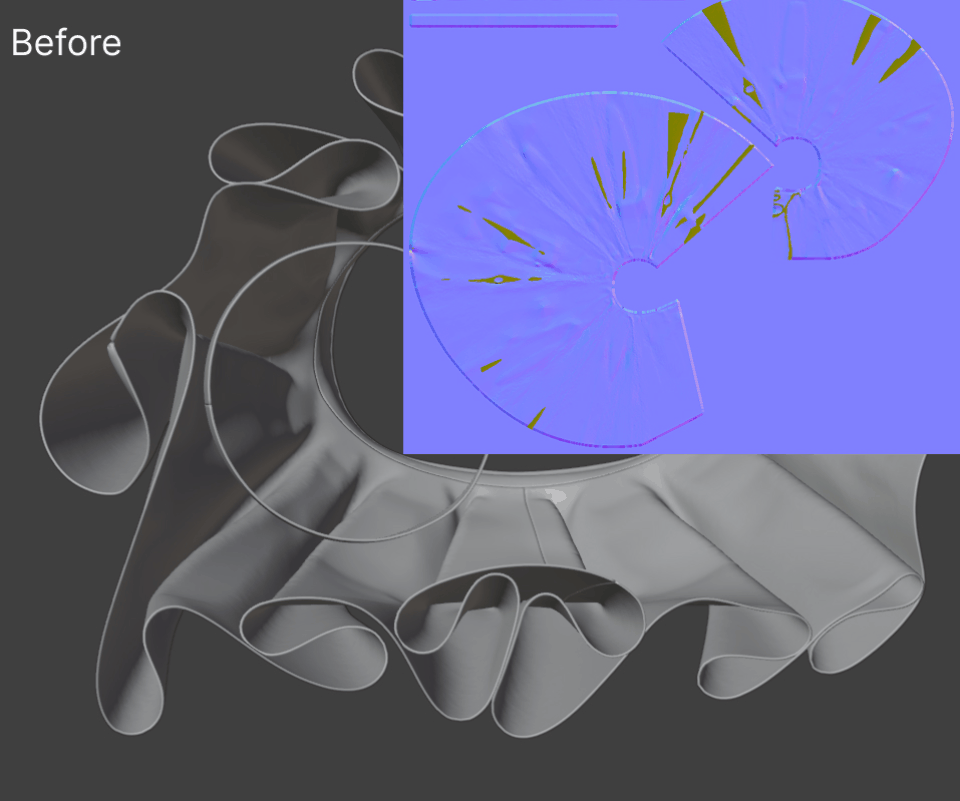

# 06. うまく動かないとき

## 赤い「Seams not analyzed」が出てボタンが動かない

**症状**: **Setup** や **Overlays** に赤い警告が出て、オーバーレイが何も描かれない。**Snap (G) → Ghost** / **Outline** を ON にしても効かない。

**原因**: 縫い目の解析結果がメモリ上に無い。この解析はゴースト・スナップ・縫い目オーバーレイの全ての土台ですが、**ファイルを開いたときと Reload Scripts で空になります。**

**対処**: **Setup → Analyze Guide** を押す（警告行の横にある **Analyze** でも同じ）。
**Guide** と **Flat SK** が未設定なら、その前に「Set the Guide and Flat SK first」の警告が出ているのでそちらを先に埋めます。
なお **Generate** / **Sync** / **Status** は実行のたびに Guide のスパンを計算し直すので、この警告が出ていても動きます。

## Inset が「needs a planar shape key」で止まる

**症状**: **Inset Pieces** または **Inset Line** を押すと
`Inset Pieces needs a planar shape key (the UV layout as geometry, e.g. UV_Map_Flattened)`
というエラーが出て中止される。

**原因**: Guide に平面シェイプキー（UV レイアウトを幾何にしたもの）が無い。**Prepare** の 2〜5 は手順 1 の結果を必要とします。

**対処**: **Setup** の **Guide** をそのオブジェクトに向け、Guide を Object Mode にして **Create Flat SK** を実行する。**Prepare** のボタンはすべて Guide に対して効くので、書き出しが複数オブジェクトに分かれている場合は **Guide** を 1 つずつ差し替えて整えます。
UV レイヤの無い Guide は警告で拒否されるので、その場合は UV を先に作ってください。

## ナイフ（K）が切れない

**症状**: 外周を作ったのにナイフで切れない。

**原因**: ナイフは面を切る道具で、境界線だけのメッシュには面がない。

**対処**: **Faces → Regions → Connect** を押す。閉じた領域すべてに面が張られ、開いた線も近くの辺まで延長して繋がれます。
少数の面だけ手で張りたい場合は、頂点を選んで Blender 標準の **F**（New Edge/Face from Vertices）でも構いません。
切ったあと **Connect** をもう一度押せば、いまのカットが作る領域に張り直されます。

## Connect のあとに小さな突起が残る

**症状**: **Connect** の実行後、ナイフの切りすぎでできた短い出っ張りが残っている（ように見える）。

**原因**: ナイフはしばしば目的の辺を少し越えて切るため、数 mm の行き止まりの枝（stub）ができます。

**対処**: 対処は不要です。**5 mm 未満の stub は Connect が自動で除去し、除去した位置（mm）を結果メッセージに列挙します。**
5 mm 以上の枝は「意図した線」として扱われ残ります。長い枝を消したいときは手で削除してください。
結果メッセージに「N end(s) left alone」（繋げなかった端）や「N region(s) could not be closed — lines crossing without a vertex?」が出ている場合は、そちらが本当の残り作業です。

## Symmetry の Self を押しても何も変わらない

**症状**: **Faces → Symmetry → Self** を実行しても形が変わらない。

**原因**: 意図と違う軸が選ばれている、あるいは **Auto** になっている（**Auto** は既定ではなくなりました — 型紙はほぼ長方形のことが多く、**Auto** は両方の折り軸を同程度に非対称と判定して拒否するため、**Self axis** の既定は水平の折り軸になりました）。1 枚の型紙は両方向に対称なことがあり（ウエストバンドは左右対称でも上下対称でもある）、そのうち片方だけがユーザーの意図したコピーです。
**Auto** は「まだ非対称なほう」を選び、両方が同程度に非対称なら拒否します。

**対処**: **Self axis** を明示的に選んでから押します。

- **Vertical axis (mirror left-right)** — 型紙の縦中心線で折り、左半分を右半分（またはその逆）から作り直す
- **Horizontal axis (mirror top-bottom)** — 横中心線で折り、下半分を上半分（またはその逆）から作り直す

**Self** は破壊的です。軸を間違えると「破壊的なのに見た目が変わらない」結果になるので、押す前に軸を確認してください。
また、正とする側は「選択している頂点のある側」です。信頼できる側の頂点を選んでから実行します。

## Subdivide したのに一部の面だけワイヤーが増えない

**症状**: **Subdivide** をかけると、ほとんどの面は 4 分割されるのに、一部の領域だけワイヤーフレームが入らず、
周囲が細かくなったぶん「そこだけエッジが消えた大きな面」に見える。

**原因**: その領域が N-gon（5 角以上の面）です。Blender の Edit Mode の Subdivide は「辺を割る」オペレータで、
**N-gon は外周の辺を割るだけで内部には 1 本もエッジを入れません**（実測: 146 角形 → 292 角形、面積は不変）。
クワッドと三角だけが内部まで分割されるので、N-gon の領域だけが取り残されて見えます。
Subdivision Surface モディファイア（Catmull-Clark）が N-gon を分割するのとは挙動が違います。

**対処**: 不具合ではないので、そのまま進めて構いません。**Subdivide は N-gon をわざと素通りさせます** —
リトポが途中の型紙が 1 枚あるだけで、他のすべてのシルエットとポリゴン数の確認ができなくなるのを避けるためです。
残っている N-gon の枚数は Subdivide の結果メッセージと **Faces** パネルの結果行に出ます
（`20 n-gon(s) left whole`）。**Finalize** も同じ枚数を報告しますが、止めはしません。

N-gon を実際に割るときは、その領域をナイフ（K）で切ってから **Connect** を押します。
自動で割らないのは、N-gon の中心に頂点を 1 つ足す方式だと 146 角形なら 146 本の辺が 1 点に集まる極ができ、
リトポの品質として使えないためです。

どこに N-gon があるかは、Edit Mode で **Select → Select All by Trait → Faces by Sides**、
Number of Vertices を 4、種別を **Greater Than** にすると選べます。

## ベイクしたマップが見えない

**症状**: **Residual** / **Sag** / **Drape** の **Bake** は成功したのに、ビューポートに何も見えない。

**原因**: Solid シェーディングは既定でテクスチャを表示しません。またプレビュー用のプレーンは平面リトポの**下**（5 mm 下）にあります。

**対処**: 次の順で確認します。

1. **Guide Maps → Preview** で見たいマップを選び、**Plane** を押す。これで `AC9_BakePreview` プレーンが作られ、Solid のビューポートが自動で **Solid の色 = Texture** に切り替わります。
2. それでも見えないときは、**Guide Maps** パネルの **Solid** の欄が **Texture** になっているか確認します（Viewport Shading > Color と同じプロパティです）。
3. **z = 0 に平らに置かれている物を手で隠します。** プレーンは z = 0 の 5mm 下にあるので、平面状態の Guide・平面リトポ・自作のベイク板などが z = 0 にあると、上から見たときにそれらが手前に来てマップを完全に隠します（型紙の形が白く塗りつぶされて見えるのがこの状態）。**Plane** ボタンは他オブジェクトの表示を意図的に触りません。
4. **Retopology** オーバーレイ（Overlays > Mesh Edit Mode > Retopology）は Edit Mode で編集中のメッシュを手前に持ち上げてZファイトを防ぐもので、下のプレーンを見えるようにする効果はありません。X-Ray は使いません。
5. Rendered シェーディングのビューポートは **Plane** が触りません（そのままでも Emission マテリアルなので見えます）。
6. ファイルを開き直した直後は **AO** / **Curvature** / **Drape** が空です。この 3 枚は .blend にパックされないので、**Drape → Bake** を押し直してください（数秒です）。

<!-- screenshot: Viewport Shading の Color = Texture と Retopology オーバーレイが ON の状態 -->

なお、ベイク中の進捗は段階表示だけです。Blender のベイク本体は途中の割合を返さないため、その区間は止まって見えます（**Drape** は内部で AO と Curvature の 2 回ベイクします）。

## 外部でノーマル / AO をベイクすると、別の面の模様が焼き込まれる

**症状**: Separate まで済ませてリトポにベイクしたのに、法線マップに隣の層の模様が出る。AO は本来明るいはずの場所が黒く潰れる。Separate をやり直したり Gap を上げても、ほとんど変わらない。

原因は 3 つあり、**どれも Guide の側ではなくベイクの設定側**です。Gap を上げても直りません。

### 1. AO は「対象以外のオブジェクト」も遮蔽物として数える

法線の Selected to Active は選択したハイポリにしか当たりませんが、**AO のレイはシーン中のレンダリング表示されている全てに当たります**。着せているアバターの素体、下に穿いているパンツ、他の衣装、そして**ベイク先の複製オブジェクト**まで。

生産データで実測した例では、スカートの表面から 4 mm 以内に、素体が 1,223 点・パンツが 3,154 点・他の衣装が 800 点ほどありました。さらにベイク先の複製（`..._Final.001` のような名前）がレンダリング表示のまま残っていて、スカート表面から **0.0〜0.3 mm** の位置でほぼ全てのレイを遮っていました。

**対処**: **AO を焼くときは、ベイク元の Guide とベイク先のリトポ以外を、すべてレンダリング非表示（アウトライナーのカメラアイコン）にします。** ビューポートで非表示にするだけでは効きません — レイが見るのはレンダリング可視性です。**`_Final.001` のような複製が残っていないかも必ず確認してください。**

### 2. ケージの押し出しが大きすぎる / 小さすぎる

低ポリから外へ押し出した位置からレイを飛ばすので、**押し出しが層の間隔より大きいと、手前の層を素通りして奥の層に当たります**。逆に 0 だと、低ポリがハイポリの内側に入っている場所でレイが最初から内側から出てしまい、当たるべき面を拾えません。

布のように層が数ミリ間隔で重なっている対象での実測（リトポ 2,856 面）:

| 押し出し | 別の面に当たった数 |
|---|---|
| 0 mm | 80 |
| 0.5 mm | 31 |
| 1 mm | 17 |
| **2 mm** | **5** |
| 5 mm | 167 |
| 10 mm | 559 |
| 100 mm | 1,135 |

**谷はかなり狭く、ギャップの半分あたりが底です。** 一部のベイクアドオンは既定値が 0.1 m（= 100 mm）で、これは布には大きすぎます。

### 3. レイの長さに上限が無い

上限が無いと、表面をかすめて外れたレイが garment を横切って遠くの面に当たります（実測で 318 mm 飛んだ例があります）。**上限を付けると、外れたレイは「当たらなかった」になり、ベイクのマージンが周囲から埋めます。自信を持って間違ったデータより空白のほうが安全です。** 上の実測では、上限を 4〜20 mm のどこかに設定するだけで残り 5 件が 0 件になりました。

**まとめ**: 押し出しはギャップの半分程度（4 mm ギャップなら 2 mm）、レイ長の上限はその 2〜3 倍。単位はメートルなので、Blender の入力欄には `0.002` と `0.006` のように入れます。

## Mirror が古いままに見える

**症状**: 2D を編集したのに Mirror の 3D 形状が前のまま。

**原因**: Mirror は (Retopo の 2D + Guide) から毎回作り直される派生物で、自動では追従しません。

**対処**: **3D View → Mirror → Refresh**（ビューポートヘッダーの **Refresh Mirror** でも同じ）を押します。Object Mode でも Retopo の Edit Mode でも動きます。

**Subdivide** は Mirror が存在すれば自動で更新します（更新に失敗した場合はその旨がメッセージに付きます）。

Mirror を手で編集した場合、その編集は次の **Refresh** で消えます。Mirror はビューアです。読み戻されるのは頂点の選択状態だけです。

## Finalize が押せない

**症状**: **Finalize** がグレーアウトしている。

**原因と対処**: ツールチップに理由が出ます。次の 4 つのいずれかです。

| 表示 | 対処 |
|---|---|
| Exit Edit Mode first (Tab). | Object Mode に戻る |
| Set the Retopo first. | **Setup** の **Retopo** を指定する（メッシュオブジェクトであること） |
| Set the Guide first. | **Setup** の **Guide** を指定する |
| Set the Guide's Flat SK first. | **Setup** の **Flat SK** を指定する |

なお **Finalize** は Retopo を変更しません。作られるのは `<Retopo名>_Final` という別オブジェクトで、何度でも実行できます。

## Clear All を押すと何が消えるのか

**症状 / 疑問**: **Advanced → Clear All AC9 Data** を押すのが怖い。

**対処**: 押すと、**まず消えるものの一覧がダイアログに出ます**（この時点ではファイルは変更されません）。内容を見てから確定できます。Object Mode 専用です。

消えるもの:

- シーン設定（Retopo / Guide / Flat SK と全オプション。これが消えるとビューポートヘッダーのボタンも出なくなります）
- Mirror オブジェクト
- Bake Preview Plane（`AC9_BakePreview` のオブジェクト・メッシュ・マテリアル）
- 全メッシュ上の `ac9_*` / `AC9_*` 属性レイヤ、`AC9_3D_Project` と `AC9_Separated` シェイプキー、頂点グループ `AC9_Project_Failed`、`AC9_Island_Colors` マテリアルスロット
- シーン・オブジェクト・メッシュ上の `ac9_*` カスタムプロパティ
- ベイク画像、ベイク用の一時マテリアル、レポート用テキストデータブロック

**残るもの: 自分のジオメトリ、UV、自分のマテリアル、Guide の Flat シェイプキー。**

例外が 1 つあります。旧シェイプキーで 3D 表示中（値 > 0.5）のリトポは、キーを消すと 2D レイアウトに戻ってしまうため、消す前に 3D 座標をメッシュに書き込みます。画面に見えているものがそのまま残ります。

設定値だけを初期化したいときは **Clear All** ではなく **Reset to Defaults** を使ってください。Retopo / Guide / Flat SK の指定とメッシュには触りません。

## Experimental のボタンが見つからない

**症状**: マニュアルにある **Grid** / **Quad Fix** / **Density** などが見当たらない。

**原因**: **Experimental tools** が OFF（既定）。

**対処**: **Edit > Preferences > Add-ons > AC9 Cloth Retopo** で **Experimental tools** を ON にします。
**Advanced** パネルの末尾にも同じ案内のヒント行が出ています。
F3 検索から呼んでも、オペレータ自身が Experimental を見ているので OFF のままでは動きません。

## Preview Fill / Grid Regions が「shapely is required」で止まる

**症状**: エラーメッセージに `shapely is required for ... but could not be imported.` と出る（Preview Fill はボタンの代わりに警告行として出る。Grid Regions は押した時点でエラーになる）。

**原因**: shapely はアドオンに wheel として同梱されていますが、その Blender 用の wheel が入らなかった状態です。既知の例は **Windows on ARM** — この環境向けの shapely wheel は PyPI に存在しないため、同梱インストールが成立しません。

**対処**: shapely は同梱物であり、手動で `pip install` する対象ではないため、代わりの手動インストール手順はありません。Windows on ARM のような未対応環境では Preview Fill と Grid Regions は単純に使えません。他の機能は shapely 無しで動きます。同梱 wheel の一覧は [02_install.md](02_install.md) を参照してください。

## Guide を編集したらオーバーレイと投影がずれた

**症状**: Guide の頂点をスカルプト / 編集したあと、縫い目線や投影が古い形のまま。

**原因**: Guide の三角形リストと 2D BVH がキャッシュされている。データブロックを差し替えずにジオメトリだけ変えた場合、自動では気づきません。

**対処**: **Advanced → Maintenance → Guide Cache → Clear**。次の Sync 系操作で自動的に再構築され、縫い目線と境界のオーバーレイのキャッシュも同時に無効化されます。

## 縫い目とリトポの位置がまるごと合わない

**症状**: オーバーレイの縫い目線がリトポと全然違う場所に描かれる。

**原因**: 座標空間の不一致（`matrix_world` や正規化のずれ）の可能性があります。

**対処**: **Advanced → Diagnostics → Seam → Spaces** を実行し、システムコンソールに出力される 3 つのバウンディングボックス（縫い目ペア、リトポ境界頂点、Guide の平面レイアウト）を見ます。
縫い目の箱とリトポの箱が重なっていなければ、別の座標空間にいます。
特定の 1 ペアだけを確認したいときは、リトポの頂点 1 つを選んで **Diagnostics → Seam → Vertex**。
